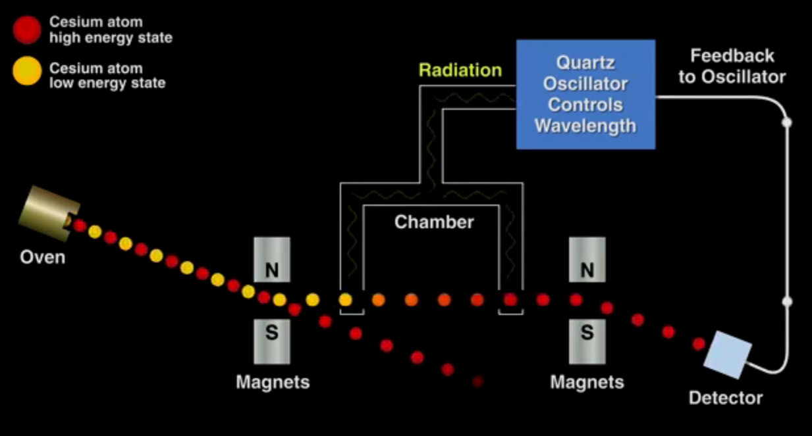

<h1 style="text-align: center;">Clock Synchronization</h1>

## Overview

Time is a deceptively tricky thing. I accumulated some basic knowledge over the
years of how time works in Linux systems, but I've never really needed to use it
until now. Recently, I started working on our IoT logging platform we built on
top of Loki. For managing distributed state, we use version vectors within
Postgres, and its been working fine. Something we lacked however was fine
grained comparisons for events across nodes. We knew going into it that we
couldn't absolutely trust them, but it would be useful to understand a series of
events without needing the overhead of tracing. This article isn't the solution
we came up with, but rather just an overview of physical time in computer
systems.


## Using Time

####  Ordering Events

In some cases, we may wish to use time to determine *happens before*
relationship for events, some examples might include:

1. Determining the order that requests come in 
2. Ordering logs to figure out the series of events that led to some outcome
3. Ordering events in concurrent environments to see if any states prevent
   progress or correctness.

For example, Linux developers may check the ring buffer to ensure systems are
started in the correct order:

```bash
~ ❯ sudo dmesg | rg usb
[    0.447472] usbcore: registered new interface driver usbfs
[    0.447472] usbcore: registered new interface driver hub
[    0.447472] usbcore: registered new device driver usb
```

#### Durations 

Other situations may arise that require us to measure the length of some time
frame. Some examples of this include: 

1. Request timeouts
2. Cache entry durations
3. Span lengths in tracing

A concrete example where durations are used is within DNS clients. When an
authoritative DNS server provides a response to a query, it includes a TTL for
how long we can cache that entry for. [systemd-resolved]() is a common DNS
resolver in Linux based systems. When systemd-resolved gets a response, it
determines how long to cache it for based on the TTL and some other metadata,
and then sets the `until` field of the entry to a timestamp which consists of
the TTL plus the current timestamp, which is defined as:

```c
timestamp = now(CLOCK_BOOTTIME);
```

For those of you wondering, CLOCK_BOOTTIME
[is](https://www.man7.org/linux/man-pages/man7/time_namespaces.7.html) a
[monotomic]() clock:

```
CLOCK_MONOTONIC (and likewise CLOCK_MONOTONIC_COARSE and CLOCK_MONOTONIC_RAW), a
nonsettable clock that represents monotonic time  since—as described  by
POSIX—"some unspecified  point in the past".

CLOCK_BOOTTIME (and likewise CLOCK_BOOTTIME_ALARM), a nonsettable clock that is
identical to CLOCK_MONOTONIC, except that it also includes any time that the
system is suspended.
```

Systemd-resolved peridocially checks to see whether that time has elasped, and
flushes the key if so:

```c
/* Remove all entries that are past their TTL */
for (;;) {
        DnsCacheItem *i;
        char key_str[DNS_RESOURCE_KEY_STRING_MAX];

        i = prioq_peek(c->by_expiry);
        if (!i)
                break;

        if (t <= 0)
                t = now(CLOCK_BOOTTIME);

        if (i->until > t)
                break;

        // ...
        // flushes the entry
}
```


#### Comparison to some reference time

Finally, in some cases we may desire to compare the current time to some
external reference time. Some examples might include:

1. Is it time to run my cron job?
2. Has my certificate expired?
3. Has my GPG key expired?

GPG keys and certificates in general expire according to some reference time.
Here is what gpg says about my public key: 

```bash
~ ❯ gpg --list-keysgpg --list-keys
pub   ed25519 2025-05-15 [C] [expires: 2040-05-11]
      BEA79BAAACD3C5CDEDCCABBCB4547B0B29A21703
uid           [ultimate] Jacob Deinum <jdeinum@nullspaces.org>
sub   ed25519 2025-05-15 [S] [expires: 2030-05-14]
sub   ed25519 2025-05-15 [A] [expires: 2030-05-14]
sub   cv25519 2025-05-15 [E] [expires: 2030-05-14]
```

So on those dates at midnight, the keys are no longer valid and should not be
used.


## Keeping Time

Now that we have a better understanding of the things we use time for, let's
take a look at the mechanisms we have to keep track of time. A *physical* clock
is a clock that tracks the number of seconds elapsed, while a *logical* clock is a
software construct that is used to order events. In this section, we'll focus on
physical clocks. I plan on writing another article on logical clocks either in
parallel or just after I finish this one.

### Quartz Crystal Oscillator

For most of us, the mechanism used to keep track of the number of seconds
elapsed is a quartz crystal oscillator (QCO). It's been a little while since my
last physics class, but I'll try to give a brief overview of how these crystals
work. Quartz is an example of a piezoelectric material. When mechanical stress
(force) is applied to these materials, an electric charge is generated. The
inverse is also true; When an electric charge is applied to the material, a
force is generated.

A quartz crystal is cut into a specific shape and size, typically in the form of
a thin wafer, using precise methods like a laser or mechanical cutting. When an
electric voltage is applied to the crystal, it deforms slightly due to the
piezoelectric effect. This deformation changes the shape of the crystal. When
the voltage is removed, the crystal attempts to return to its original shape,
and this process causes the crystal to vibrate at a very stable frequency. These
vibrations (oscillations) are what are used to keep time. 

The frequency of oscillation is highly stable, typically accurate to within
around 50 parts per million (ppm). This means that over the course of a day, the
oscillator could be off by as much as 4.3 seconds (assuming a 24-hour period),
or about 50 microseconds per second.  

One of the primary problems with QCOs is that their oscillation changes with
temperature. The crystals themselves are designed to be the most accurate at
room temperature (20 degrees celcius). Deviating from this temperature results
in a quadratic decrease in the clock speed: `Δf(T)≈k⋅(T−T0)` where T0 ~ 20
degrees Celsius.

What this means is that if your system is under a lot of load, say at or over
capacity for the number of requests it can handle per second, the QCO will
oscillate at a different frequency and time will appear to move faster than it
should:


In Linux systems, we can see the name of our hardware clock by looking in the
`/sys` directory:

```bash
~ ❯ cat /sys/class/rtc/rtc0/name
rtc_cmos rtc_cmos
```

We can use the `hwclock` command to interact with our hardware clock, including
syncing with the system time, or getting it to predict its own drift.

```bash
~ ❯ sudo hwclock
2025-06-03 09:51:23.637481-06:00
```


### Atomic Clocks

For use cases where more accuracy is needed, atomic clocks are an alternative to
QCOs that use the transitions of atoms from one energy state to another as a
reference.

The basis for atomic clocks is a collection of atoms that can be in one of two
energy states. Typically, atoms with very specific and stable energy differences
like Cesium-133 are chosen. A number of these atoms are prepared by putting them
in the lower energy state. By exposing these atoms to radiation of a particular
frequency, we can get the maximum number of atoms transitioning to their higher
energy state. By measuring the number of atoms that transitioned between these
states, we can determine how close our microwave oscillator is to being the
exact frequency of the natural transition of the atom, and make small adjustments
if needed. The result is the we can use the microwave oscillator as an extremely
stable time source. For Cesium, it oscillates 9,192,631,770 times per second.
So we count the number of oscillations and derive elapsed time from that. This
is actually how the SI unit second (S) is defined. 

 

[source](https://hackaday.com/wp-content/uploads/2015/10/atomicclock.png)

GPS, the system we all know and love consists of a series of satellites around
the globe. Each of these satellites contain an atomic clock. Therefore, one
option to get time from an atomic clock system is to purchase a GPS receiver
that can read these values from the satellite system. Using GPS receivers as
PTP grandfather sources is the approach that [Jane
Street](https://signalsandthreads.com/clock-synchronization/?trk=public_post_comment-text)
takes.

Atomic clocks are much much more accurate than QCOs. For example,
[NIST-F2](https://en.wikipedia.org/wiki/NIST-F2) measures time with an
uncertainty of 1 second in 300 million years.

## Operating System Clocks

The oscillations produced by your hardware clock source drive a hardware timer
that triggers kernel interrupts at set intervals. The kernel uses these
interrupts to update both the monotonic and real time clocks. 

#### Monotomic

The monotonic clock is a clock source in Linux that measures the amount of time
elapsed since some arbitrary point in time. Typically this when the device
boots, but it can vary per platform. Because of this, comparing monotonic
timestamps from two different machines typically has no meaning. Another
property that monotonic clocks possess is that they are guaranteed to only move
forwards. 

Monotonic clocks still get adjusted by the Network Time Daemon, but only the
rate at which time moves forward is adjusted (no setting the clock to the
correct value). Literature has coined the term *slewing* for this process.

Because the monotonic clocks only move forward, they are well suited to
measuring [durations](#durations). Indeed, libraries like tokio use the
monotonic clock to measure
[durations](https://docs.rs/tokio/latest/tokio/time/struct.Instant.html).
Therefore the following is valid:

```rust
use std::time::{Duration, Instant};
// ...
let start = Instant::now();
doSomething();
let end = Instant::now();

let diff = end - start;  // CORRECT 
                         // (barring that each tick may not be the same length)
```

#### Real Time Clock

The wall clock, or alternatively the real time clock in Linux is the familiar
clock on your computer. It tells you the time in some format that is useful to
you. Two common formats within computer systems are:

1. [Unix Time](https://en.wikipedia.org/wiki/Unix_time) (seconds since January 1st, 1970 UTC)
2. [ISO 8601](https://en.wikipedia.org/wiki/ISO_8601) (2025-02-16 10:58:44.966864492+00:00)

> **NOTE:** You might run across version like RFC-3339 or RFC-2822. These are
> implementations of ISO 8601 with slight variations between them.

Under the hood, the real time clock is just stored as a base value
(`realtime_offset`) that is added to the monotonic clock to get the current real
time. The `realtime_offset` is calculated at boot using the RTC and some other
info.  

Unlike the [monotonic](#monotomic) clocks, the real time clock does not
guarantee that it only moves forward. Services like NTP can forceably set the
value of the real time clock at will (although NTP has some
[restrictions](https://www.ntp.org/documentation/4.2.8-series/clock/) on when it
will step the clock). Therefore, the following is not valid:

```rust
use std::time::{Duration, SystemTime};
// ...
let start = SystemTime::now();
doSomething();
let end = SystemTime:now();

let diff = end - start;  // INCORRECT 
                         // diff can be < 0 if NTP steps the clock during line 4
```

## NTP & Clock Synchronization

Now that we understand the two types of clocks on Linux (Real Time & Monotonic),
we are ready to move on to NTP, which is a common mechanism used to synchronize
clocks to some external source. Before looking at NTP, it's important to
understand what we mean by *synchronize* here. Synchronize in this case refers
to:

1. Having the value of the clock be close to some desired value (Real time only)
2. Having the clock move forward at the correct rate (Real time and Monotonic)

NTP handles both of these cases by *stepping* the clock (setting its value) and
*slewing* the clock (changing the rate at which it moves forward). I won't go
into the detail of how it does this within the kernel, but it's source can be
found [here](https://github.com/torvalds/linux/blob/master/kernel/time/ntp.c).
Additionally the official
[docs](https://www.ntp.org/documentation/4.2.8-series/sitemap/) are an excellent
resource.

IMAGE SHOWING SLEWING FROM SYSTEM

IMAGE SHOWING STEPPING FROM SYSTEM

### Overview 

So how does NTP actually determine what the clock drift is? 


1. An overview of NTP 
2. How NTP actually works (4 timestamps + calculations)

## The Challenges of Synchronization
1. Timer per CPU, OS has to provide a consistent view 
3. Network delays affect time synchronization 
4. Users might actually want clocks to be apart (for games)
5. Can you trust your sources? Is there built in protection against outliers?
6. Virtual machine clocks, plus process pauses

## The Problems of Unsynchronized Clocks
1. Algorithms that depend on synchronized clocks
2. Last Write Wins 
